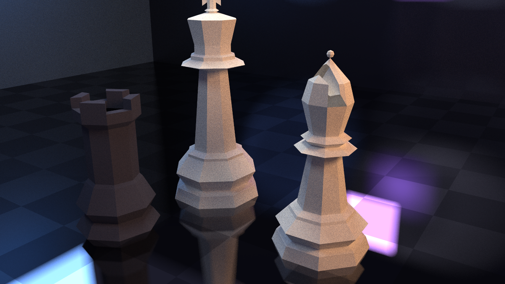
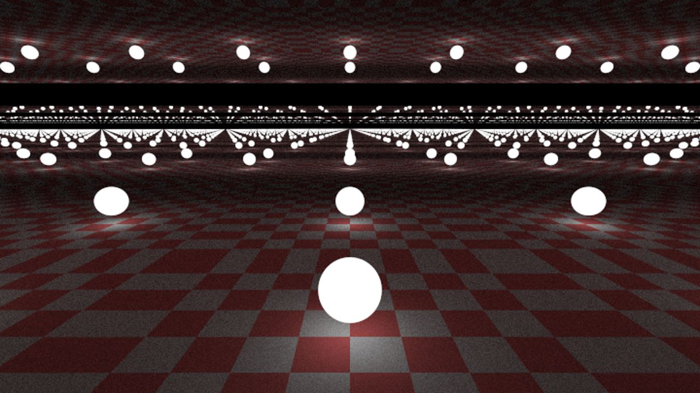

# Raytracer

A performant raytracer built from scratch in C, featuring realistic lighting, reflections, shadows, and support for complex 3D models.

## 🌟 Features

- **Realistic Rendering**: Advanced ray tracing algorithms for lifelike lighting, reflections, and shadows
- **Multiple Materials**: Support for Lambertian (matte), Metal (reflective), and Dielectric (transparent/translucent) materials
- **Complex Geometry**: Render spheres, triangles, planes, quads, and complex meshes from .obj files
- **Scene Parser**: Custom scene description language for easy scene composition
- **Anti-aliasing**: Multi-sampling for smooth, high-quality images
- **BVH Optimization**: Bounding Volume Hierarchy for efficient rendering of complex scenes
- **Motion Blur**: Animated scenes with cinematic motion blur effects
- **Transformations**: Translation and rotation support for dynamic scenes
- **Multiple Textures**: Solid colors and checkered patterns

## 🖼️ Gallery

<div style="display: grid; grid-template-columns: repeat(auto-fit, minmax(400px, 1fr)); gap: 20px; max-width: 1200px; margin: 0 auto;">
  <div style="text-align: center;">
    
    <p><em>Chess pieces scene showcasing different materials and lighting</em></p>
  </div>
  <div style="text-align: center;">
    
    <p><em>Complex tree geometry with detailed branching structure</em></p>
  </div>
  <div style="text-align: center;">
    
    <p><em>Eagle model rendered with golden metallic material</em></p>
  </div>
  <div style="text-align: center;">
    
    <p><em>Eagle model with silver reflective material</em></p>
  </div>
  <div style="text-align: center;">
    
    <p><em>Infinite reflection effect with multiple mirrors</em></p>
  </div>
  <div style="text-align: center;">
    
    <p><em>Collection of metallic spheres with varying roughness</em></p>
  </div>
  <div style="text-align: center;">
    
    <p><em>Metallic surfaces illuminated by blue lighting</em></p>
  </div>
  <div style="text-align: center;">
    
    <p><em>Creative scene composition with mixed materials and lighting</em></p>
  </div>
</div>

## 🛠️ How to run

```bash
# Clone the repository
git clone https://github.com/AhmedBlackEye/ray-tracing
cd raytracer

# Build the project
chmod +x run.sh
./run.sh scene.txt output.ppm
```

### Scene Files

Scene files use a custom text format to describe 3D scenes. Examples can be found in the `scenes/` directory:

- `heart.txt` - Heart-shaped model
- `cow.txt` - Complex cow mesh
- `chess.txt` - Chess pieces scene
- `crystal_cave.txt` - Crystal cave environment
- `metal_spheres.txt` - Reflective spheres demonstration

### Custom Scenes

Create your own scene files using the scene description language. The parser supports:
- Geometric primitives (spheres, planes, triangles, quads)
- .obj file loading for complex meshes
- Material definitions (lambertian, metal, dielectric)
- Lighting and camera configuration
- Transformations and animations

## 📁 Project Structure

```
raytracer/
├── app/           # Application layer (camera, scene management)
├── core/          # Core mathematics and utilities (vectors, rays, colors)
├── hittable/      # Geometric objects and intersection testing
├── material/      # Material implementations
├── parsers/       # Scene and .obj file parsers
├── texture/       # Texture implementations
├── models/        # Sample .obj models
├── scenes/        # Pre-made scene files
└── build/         # Build artifacts
```

## 🎯 Technical Highlights

### Ray Tracing Algorithm
- Backward ray tracing from camera through pixels
- Recursive light bouncing for realistic global illumination
- Monte Carlo sampling for anti-aliasing

### Performance Optimizations
- **BVH (Bounding Volume Hierarchy)**: Logarithmic-time intersection testing for complex meshes
- **Efficient Memory Management**: Custom dynamic arrays and optimized data structures

### Advanced Features
- **Shadow Acne Prevention**: Bias correction for numerical precision errors
- **Motion Blur**: Time-based ray sampling for animated sequences
- **Flexible Camera System**: Configurable FOV, position, focus, and aspect ratios

## 🎨 Sample Renders

The raytracer can handle:
- Complex .obj models with thousands of triangles
- Realistic material properties and lighting
- Transparent and reflective surfaces
- Artistic scenes with multiple light sources

*Output format: PPM (Portable Pixmap) files*

## 🔧 Configuration

### Camera Settings
- Position and orientation
- Field of view
- Focus distance and aperture
- Image resolution and aspect ratio

### Rendering Quality
- Samples per pixel (anti-aliasing)
- Maximum ray bounce depth
- Resolution settings

## 🤝 Contributing

This project was developed as a group effort.

## 🙏 Acknowledgments

- Ray tracing algorithms inspired by "Ray Tracing in One Weekend" series
- .obj file format support for complex 3D models
- Various online resources for graphics programming techniques